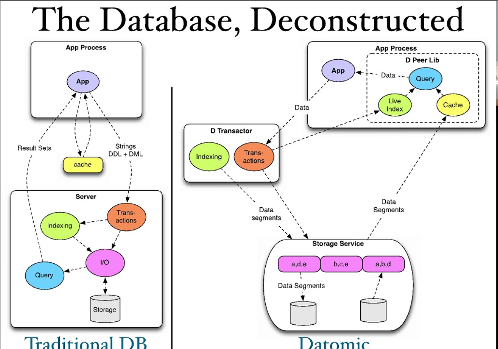

# DatomicExperiments

## Docker image for running Datomic locally 

* Datomic is a different kind of database. It brings the database to the application and makes things a lot simpler to consume from an application perspective. All the query results come back to us as native collections or primitives. Each application that uses the database acts as a Peer and can have its own local cache to speed up performance. Here is a comparison of how the traditional database architecture compares with Datomic. 

* This guide shows how to use docker to run datomic locally. This is pretty much a pre-requisite for almost all the other experiments we do. More details on this <a href="./docker-run/README.md">here</a>

* This guide follows the movies tutorial that is part of the datomic documentation. More details are <a href="./DatomicExperiments/README.md">here</a>

* This guide follows the Seattle Data tutorial. Seattle has many communities and this data is represented inside Datomic using a bunch of constructs like enums. More details are <a href="./DatomicExperiments/Seattle-Data.md">here</a>

* This guide takes the sample postgres database we get as part of postgres documentation. It is called dvdrental and contains data about the dvd rental store. We take the data from Postgres and load it into Datomic after reformating and creating the required schemas. This is a comprehensive example that shows how we can use Datomic for non-trivial use-cases. More details are <a href="./DatomicExperiments/DVD_Rental.md">here</a>
