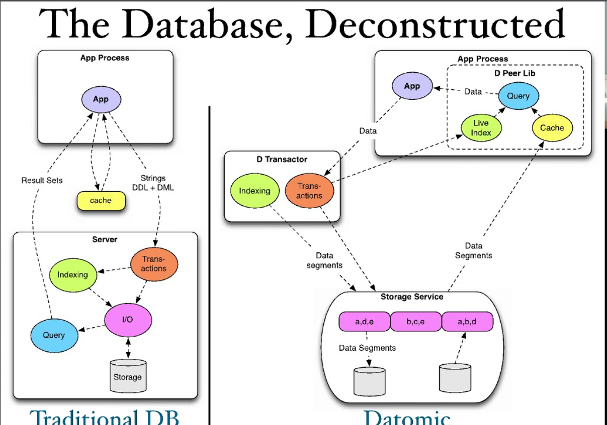

# DatomicExperiments

## Docker image for running Datomic locally 

* Datomic is a different kind of database. It brings the database to the application and makes things a lot simpler to consume from an application perspective. All the query results come back to us as native collections or primitives. Each application that uses the database acts as a Peer and can have its own local cache to speed up performance. Here is a comparison of how the traditional database architecture compares with Datomic. 

* This guide shows how to use docker to run datomic locally. This is a free verion of datomic that someone has put together. It serves as a simple introduction to starting docker and loading the mbrainz dataset and query it. The only issue is that it is dependent on a custom library, and does not work with the Peer libraries published by Datomic in the maven central repo.  More details on this <a href="./docker-run/README.md">here</a>

* This guide follows the movies tutorial that is part of the datomic documentation. More details are <a href="./DatomicInMem/README.md">here</a>

* This guide follows the Seattle Data tutorial. Seattle has many communities and this data is represented inside Datomic using a bunch of constructs like enums. More details are <a href="./DatomicInMem/Seattle-Data.md">here</a>

* This guide takes the sample postgres database we get as part of postgres documentation. It is called dvdrental and contains data about the dvd rental store. We take the data from Postgres and load it into Datomic after reformating and creating the required schemas. This is a comprehensive example that shows how we can use Datomic for non-trivial use-cases. More details are <a href="./DatomicInMem/DVD_Rental.md">here</a>

* This guide walks through how to download datomic pro from the website, and setup a docker container based on ubuntu. We will then start the transactor from the ubuntu container and connect to it remotely from the local computer. We need to tweak a few settings to make it work on docker and load the data from the local system. More details are <a href="./DatomicInDocker/DVD_Rental_On_Docker.md">here</a>

* This guide uses Datomic with a Postgres SQL backing store. We use docker-compose to spawn 2 containers one with datomic mounted from local to an ubuntu container, and another postgres container. We then start the transactor to point to datomic via the custom network and access it from the lcoal computer. More details are <a href="./DatomicOnPostgres/README.md">here</a>
